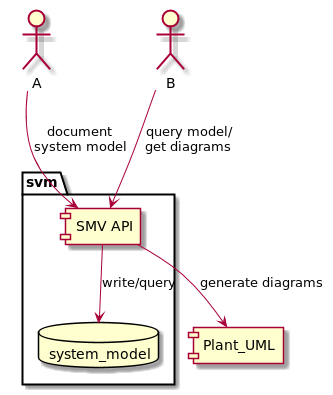
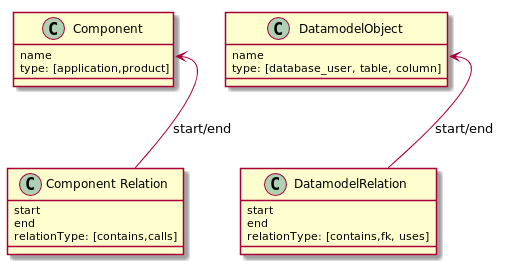

# System Model & Visualizer - SMV

This utility has the purpose to put in a graph model the dependencies of a system of all kinds
(until now system lanscape, datamodel) and use it as input for plantuml to generate a corresponding diagram

## Features
* model your system in a graph representation
* types of models
    * component model for application applications, software products etc
    * datamodel
* generates diagrams of your system using plantuml markdown
* exposes api endpoint to encourage colaboration
* stores the model in a json file

## Prerequisites
* python3.5 & libraries
* java
* plantuml.1.2017.19.jar and PLANT_UML environment variable pointing to the jar

## How to run
* /examples contains command lines usages
* python3 diagram-visualizer-web.py represents the endpoint
* todo: how to build and install

## C4 diagram

How it looks under the hood
    

## Datamodel

What are the supported modelling options

## Install
* pip install -r [requirements.txt](requirements.txt)
* pip install [binary](https://github.com/zalum/system-model-visualizer/releases)

## Backlog
* plugin system for different sources of data: jira, aws, oracle etc
* improve validation and http error codes of endpoint
* deployment infrastructure: docker, pyenv
* make a difference between table id and name, and allow special caracters in the table name
* annotate with timestamp the relations and components, to extract snapshots in time of the model

## Code refactorings
* improve encapsulation
* rename names to python standards
* replace response object wrappers
* fix transformation of a model to a more specific one: sm.data_model(system_model.graph)
* improve identity of nodes

## Project rename
- mo/hub = model hub, a hub for your system model

